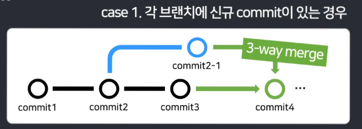
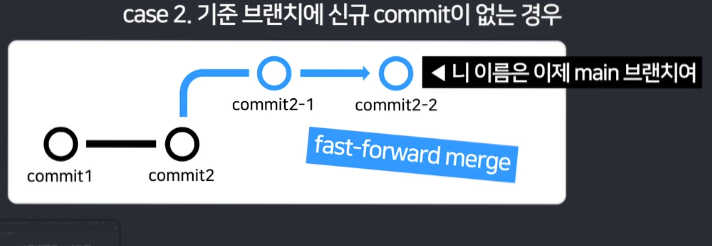
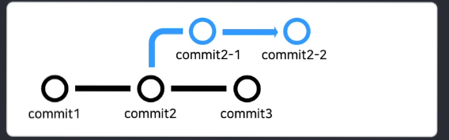
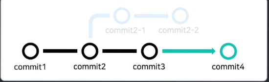

# Document for Problem_2 by Daeung-03
---

## 1. Merge와 Rebase의 차이점
둘 다 Git에서 브랜치를 병합하는 방법이라는 점은 동일하다. 그러나 기본 동작 방식에서 차이가 있다.
*Merge* : 두 브랜치의 변경사항을 결합하여 새로운 merge commit을 생성 -> 기존 브랜치들의 기록 남기고, 분기점, 합류점 효시
*Rebase*: 한 브랜치의 커밋들을 다른 브랜치의 최신 커밋 위에 다시 적용함 -> 기록을 선형을 남김. 기존 커밋 해시값 변경

또 충동을 해결(merge conflict)할 때도 git merge는 한 번에 모두 해결해야 하지만, rebase는 각 커밋마다 해결해줘야 한다.

rebase는 log기록이 깔끔해진다는 장점이 있지만, 되돌리기가 어려워지고, 기존 커밋의 해시값이 변경되기 때문에 협업에서 신뢰도 문제가 발생한다.

**언제 사용하면 좋을까?**
Merge
    1. 협업 환경에서 팀원들과 브랜치를 공유할 때
    2. 히스토리 추적이 중요한 프로젝트
    3. 안전성을 우선시하는 경우
    4. 복잡한 충돌이 예상되는 상황
Rebase
    1. 개인 작업 또는 소규모 팀에서
    2. 깔끔한 히스토리를 원할 때
    3. 아직 공유하지 않은 로컬 브랜치에서

## 2. Megrg 비교
> merge의 여러 형태를 이해하고 조작해보는 게 향후 취업시 회사의 여러 가이드를 따라가는 데 도움이 될 것 같아 작성합니다.

**3-Way Merge**:가장 기본 형태, 복잡하지만 모든 기록을 남길 수 있다는 점에서 신뢰도가 가장 높다
| 
---|---|
**Fast Forwar Merge**: 단순히 브랜치 포인트만 이동함. 커밋이 남지 않아 선형적인 구조!
| 
---|---|
**Squash and Merge**: 3-Way merge의 지저분함을 해결함. 새로운 커밋으로 하나 만들어 그 커밋을 merge하는 방식

회사의 가이드라인이 있을 것이고, 그것을 빠르게 이해하기 위해서는 이정도 기본을 알고 있으면 좋을 듯하다.